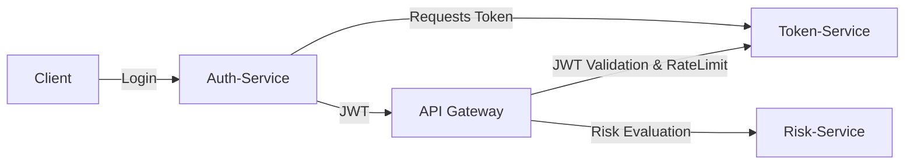

# IAM PoC – Identity and Access Management Proof of Concept

This repository contains a Proof of Concept (PoC) for a microservices-based \*\*Identity and Access Management (IAM)\*\* system.

The goal is to demonstrate how to integrate authentication, token lifecycle management, risk evaluation, and security controls (rate limiting, JWT validation, TODO -> observability) into a unified architecture.

---

## 📂 Project Structure

iam-poc/
  ── README.md # Global documentation (this file)
  ── auth-service/ # Authentication service (login → requests tokens)  
  ── token-service/ # Security Token Service (STS) → issues \& validates JWTs
  ── gateway-service/ # API Gateway with JWT filter + Bucket4j rate limiter
  ── risk-service/ # Fraud/risk scoring service

## Each microservice is an independent Spring Boot project with its own \*\*Gradle build\*\*:

## 🧩 Microservices Overview

### 🔹 Auth-Service

- Provides dummy login endpoint (`/auth/login`).

- Delegates JWT issuance and validation to \*\*Token-Service\*\*.

- Returns API tokens to clients.

### 🔹 Token-Service (STS)

- Issues and validates JWTs.

- Manages generation, validation and renew.

- Provides `/token/generation`,`/token/validate` and `/token/renew` endpoints.

### 🔹 Gateway-Service

- Entry point for clients.

- Features:

  **JWT validation filter** (delegates to Token-Service).

  **Rate limiting** via Bucket4j.

  **Risk evaluation** calls to Risk-Service.

### 🔹 Risk-Service

- Exposes `/risk/score` endpoint.

- Provides a basic fraud/abuse detection mock (can be extended with ML).

---

## 🔄 Flow Diagram

⚙️ How to Run

Each service can be started independently using Gradle:
cd service-name
./gradlew bootRun

Example (running the gateway):
cd gateway-service
./gradlew bootRun

Default ports:

Auth-Service → 8081

Token-Service → 8082

Gateway-Service → 8080

Risk-Service → 8083

🚀 Usage Example

Login (obtain a JWT):
curl -X POST "http://localhost:8081/auth/login" \
 -H "Content-Type: application/json" \
 -d '{"username": "admin", "password": "password"}'

Call a protected endpoint via Gateway:
curl -X POST "http://localhost:8080/protected" \
 -H "Authorization: Bearer <JWT>"

📌 Next Steps

Add centralized logging + integration with SIEM/UEBA.
Token generation control with database: token Issuance Logging, Revocation (Blacklist / Whitelist), Rotation \& Audit Trails, Session Control
Automate API key rotation.
Extend Risk-Service with ML-based detection.
Integrate with orchestration tools (e.g., N8N, MCP).

🛠️ Tech Stack

Java 17

Spring Boot 3.x

Gradle

Spring Security

JJWT (Java JWT)

Bucket4j

** coming soon ** Kafka (optional, for logging/streaming)
